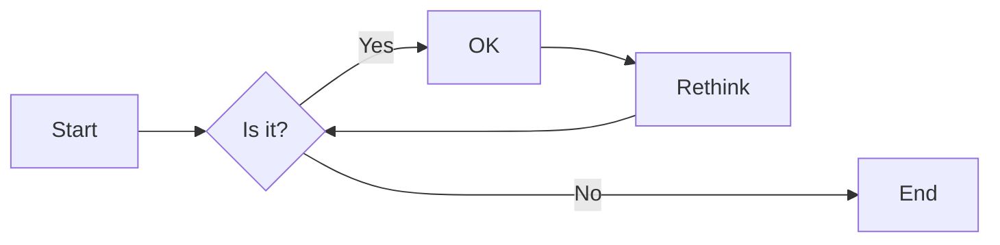

# 实验二 Python变量、简单数据类型

班级： 21计科4班

学号： 20210203410

姓名： 刘杰

Github地址：https://github.com/Lxiunneg/my_python_course

CodeWars地址：https://www.codewars.com/users/Lxiunneg

---

## 实验目的

1. 使用VSCode编写和运行Python程序
2. 学习Python变量和简单数据类型

## 实验环境

1. Git
2. Python 3.10
3. VSCode
4. VSCode插件

## 实验内容和步骤

### 第一部分

实验环境的安装

1. 安装Python，从Python官网下载Python 3.10安装包，下载后直接点击可以安装：[Python官网地址](https://www.python.org/downloads/)
2. 为了在VSCode集成环境下编写和运行Python程序，安装下列VScode插件
   - Python
   - Python Environment Manager
   - Python Indent
   - Python Extended
   - Python Docstring Generator
   - Jupyter
   - indent-rainbow
   - Jinja

---

### 第二部分

Python变量、简单数据类型和列表简介

完成教材《Python编程从入门到实践》下列章节的练习：

- 第2章 变量和简单数据类型

---

### 第三部分

在[Codewars网站](https://www.codewars.com)注册账号，完成下列Kata挑战：

---

#### 第1题：求离整数n最近的平方数（Find Nearest square number）

难度：8kyu

你的任务是找到一个正整数n的最近的平方数
例如，如果n=111，那么nearest_sq(n)（nearestSq(n)）等于121，因为111比100（10的平方）更接近121（11的平方）。
如果n已经是完全平方（例如n=144，n=81，等等），你需要直接返回n。
代码提交地址
<https://www.codewars.com/kata/5a805d8cafa10f8b930005ba>

---

#### 第2题：弹跳的球（Bouncing Balls）

难度：6kyu

一个孩子在一栋高楼的第N层玩球。这层楼离地面的高度h是已知的。他把球从窗口扔出去。球弹了起来,  例如:弹到其高度的三分之二（弹力为0.66）。他的母亲从离地面w米的窗户向外看,母亲会看到球在她的窗前经过多少次（包括球下落和反弹的时候）？

一个有效的实验必须满足三个条件：

- 参数 "h"（米）必须大于0
- 参数 "bounce "必须大于0且小于1
- 参数 “window "必须小于h。

如果以上三个条件都满足，返回一个正整数，否则返回-1。
**注意:只有当反弹球的高度严格大于窗口参数时，才能看到球。**
代码提交地址
<https://www.codewars.com/kata/5544c7a5cb454edb3c000047/train/python>

---

#### 第3题： 元音统计(Vowel Count)

难度： 7kyu

返回给定字符串中元音的数量（计数）。对于这个Kata，我们将考虑a、e、i、o、u作为元音（但不包括y）。输入的字符串将只由小写字母和/或空格组成。

代码提交地址：
<https://www.codewars.com/kata/54ff3102c1bad923760001f3>

---

#### 第4题：偶数或者奇数（Even or Odd）

难度：8kyu

创建一个函数接收一个整数作为参数，当整数为偶数时返回”Even”当整数位奇数时返回”Odd”。
代码提交地址：
<https://www.codewars.com/kata/53da3dbb4a5168369a0000fe>

### 第四部分

使用Mermaid绘制程序流程图

安装Mermaid的VSCode插件：

- Markdown Preview Mermaid Support
- Mermaid Markdown Syntax Highlighting

使用Markdown语法绘制你的程序绘制程序流程图（至少一个），Markdown代码如下：


显示效果如下：



查看Mermaid流程图语法-->[点击这里](https://mermaid.js.org/syntax/flowchart.html)

使用Markdown编辑器（例如VScode）编写本次实验的实验报告，包括[实验过程与结果](#实验过程与结果)、[实验考查](#实验考查)和[实验总结](#实验总结)，并将其导出为 **PDF格式** 来提交。

## 实验过程与结果

请将实验过程与结果放在这里，包括：

- [第二部分 Python变量、简单数据类型和列表简介](#第二部分)

- [第三部分 Codewars Kata挑战](#第三部分)

  - 第1题：求离整数n最近的平方数（Find Nearest square number）

    难度：8kyu

    你的任务是找到一个正整数n的最近的平方数例如，如果n=111，那么nearest_sq(n)（nearestSq(n)）等于121，因为111比100（10的平方）更接近121（11的平方）。

    如果n已经是完全平方（例如n=144，n=81，等等），你需要直接返回n。

    代码提交地址
    <https://www.codewars.com/kata/5a805d8cafa10f8b930005ba>

    

    解法：

    ```py
    import math
    def nearest_sq(n):
        # pass
        num = int(math.sqrt(n))
        next_num = num + 1
        if (next_num ** 2 - n) < (n - num ** 2):
            return next_num ** 2
        else:
            return num ** 2
    ```

    ```mermaid
    flowchart LR
    	A[开始] --> B[对数开平方取整数部分num 和 next_num] --> C{ 'next_num ** 2 - n' < 'n - num ** 2'} -- Yes --> D[return next_num ** 2]
    	C -->|No|E[return num ** 2]
    	D & E --> F[结束]
    ```

    

  - #### 第2题：弹跳的球（Bouncing Balls）

    难度：6kyu

    一个孩子在一栋高楼的第N层玩球。这层楼离地面的高度h是已知的。他把球从窗口扔出去。球弹了起来,  例如:弹到其高度的三分之二（弹力为0.66）。他的母亲从离地面w米的窗户向外看,母亲会看到球在她的窗前经过多少次（包括球下落和反弹的时候）？

    一个有效的实验必须满足三个条件：

    - 参数 "h"（米）必须大于0
    - 参数 "bounce "必须大于0且小于1
    - 参数 “window "必须小于h。

    如果以上三个条件都满足，返回一个正整数，否则返回-1。
    **注意:只有当反弹球的高度严格大于窗口参数时，才能看到球。**
    代码提交地址
    <https://www.codewars.com/kata/5544c7a5cb454edb3c000047/train/python>

    

    解法：

    ```py
    def bouncing_ball(h, bounce, window):
        # your code
        if h <= 0 or bounce <= 0 or bounce >= 1 or window >= h:
            return -1
        count = 1
        while(h > window):
            h = h * bounce
            if h > window:
                count += 2
        return count
    ```

    ```mermaid
    flowchart LR
    A[开始] --> B{进行参数校对} 
    A --> C{h > window?}
    B --> id1[return -1]
    id1 -->|Yes|Z[结束]
    C -->|Yes|D[h = h * bounce]
    D -->F{h > window?}
    F -->|No|C
    F -->|Yes|G[count += 2]
    G --> C
    C -->|No|id2[return count]
    id2 --> Z
    ```

    

  - #### 第3题： 元音统计(Vowel Count)

    难度： 7kyu

    返回给定字符串中元音的数量（计数）。对于这个Kata，我们将考虑a、e、i、o、u作为元音（但不包括y）。输入的字符串将只由小写字母和/或空格组成。

    代码提交地址：
    <https://www.codewars.com/kata/54ff3102c1bad923760001f3>

    

    解法：

    ```py
    def get_count(sentence):
        count = 0
        words = ['a','e','i','o','u']
        for c in sentence:
            if c in words:
                count += 1
        return count
    ```

    ```mermaid
    flowchart LR
    A[开始] --> B{position != end of string ?} 
    B --> |Yes|C{is Vowel?}
    C --> |Yes|D[count += 1,position += 1]
    D --> B
    
    B --> |No|Z[return count]
    Z --> id[结束]
    ```

    

  - #### 第4题：偶数或者奇数（Even or Odd）

    难度：8kyu

    创建一个函数接收一个整数作为参数，当整数为偶数时返回”Even”当整数位奇数时返回”Odd”。
    代码提交地址：
    <https://www.codewars.com/kata/53da3dbb4a5168369a0000fe>

    

    解法：

    ```py
    def even_or_odd(number):
        if number % 2 == 0:
            return 'Even'
        else:
            return 'Odd'
    ```

    ```mermaid
    flowchart LR
    A[开始] --> B{number %2 == 0 ?}
    B --> |Yes|C[return 'Even']
    B --> |No|D[return 'Odd']
    C & D --> Z[结束]
    ```

    


## 实验考查

请使用自己的语言并使用尽量简短代码示例回答下面的问题，这些问题将在实验检查时用于提问和答辩以及实际的操作。

1. Python中的简单数据类型有那些？我们可以对这些数据类型做哪些操作？

   1. 整数（int）：表示整数值，如1、2、3等。
   2. 浮点数（float）：表示带有小数部分的数值，如3.14、2.718等。
   3. 布尔值（bool）：表示真或假，只有两个取值True和False。
   4. 字符串（str）：表示文本或字符序列，使用引号（单引号或双引号）括起来，如"Hello, World!"。

   操作：

   1. 算术操作：对整数和浮点数可以执行加（+）、减（-）、乘（*）、除（/）、求余（%）等操作。
   2. 比较操作：可以使用比较运算符（如==、!=、<、>、<=、>=）对数据进行比较，比较的结果返回布尔值（True或False）。
   3. 逻辑操作：可以使用逻辑运算符（如and、or、not）对布尔值进行逻辑运算，返回布尔值作为结果。
   4. 字符串操作：可以使用字符串连接（+）将字符串拼接在一起，可以使用索引和切片操作来访问字符串的特定部分，还可以使用一些字符串方法来处理和转换字符串。
   5. 类型转换：可以使用内置的类型转换函数（如int()、float()、str()、bool()）将一个数据类型转换为另一个数据类型。

2. 为什么说Python中的变量都是标签？

   在Python中，变量被视为标签而不是存储值的盒子。这是因为在Python中，变量实际上是对对象的引用，而不是直接存储值。

3. 有哪些方法可以提高Python代码的可读性？

   变量取名、函数封装

## 实验总结

这次实验然我学习到了python中的数据类型和简单的数据结构，初步了解了函数式编程的美妙之处，收获良多！
