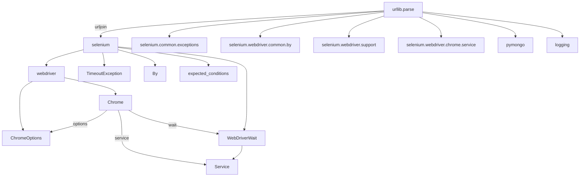

# 《Python程序设计基础》程序设计作品说明书

题目： 基于`Selenium`与`ChromrDriver`实现对电影排名网站的信息收集的爬虫

学院： 21计科04

姓名： 刘杰

学号： B20210302410

指导教师： 周景

起止日期：2023.11.10-2023.12.10

## 摘要

_介绍本次设计完成的项目的概述，本文的主要内容，总结你主要完成的工作以及关键词。_

关键词：爬虫、Selenium、信息爬取、自动化测试、MongoDB，json
本次项目是使用Selenium和ChromeDriver来进电影评分网站来进行对电影简述、演职人员、电影评分等信息的爬取，并且生成为json数据存储在Mongodb数据库中。


本文的主要内容为探究Selenium包配合ChromeDriver自动化测试工具，通过模拟浏览器的运行来爬取数据，从而绕开不同网站采用不同的`Ajax`数据接口逻辑而导致重复推导`token`参数的逻辑。

我完成的工作是分析目标URL：https://spa2.scrape.center'中的页面逻辑、数据结构，编写能够正确爬取页面数据的爬取程序，同时生成相应的`json`数据格式，并且存贮在本地的`MongoDB`中。

## 第1章 需求分析

_本章的内容主要包括系统的需求分析，系统主要需要实现的功能有哪些，可以帮助用户解决哪些问题等等。_

本实验的实验平台：
- OS: Ubuntu 22.04.3 LTS on Windows 10 x86_64
- CPU: 11th Gen Intel i7-11800H (16) @ 2.303GHz
- Memory: 32GB

本系统所解决的问题主要是解决因为网站开发者对数据请求的API进行加密而导致单纯的发送`get`请求所得到的`html`源码不会包含想要爬取的重要信息的问题。

系统实现了使用python中的`seleninum`库和谷歌自动化测试工具`ChromeDriver`来驱动`Chorme`浏览器来对目标网站: https://spa2.scrape.center 中的信息进行并行爬取。

其中信息包括：
- `_id`:数据的id -> object
- `url`:数据来源URL -> string
- `categories`:电影分类数据 -> list
- `cover`:电影封面的URL -> string
- `name`:电影名 -> string
- `drama`:电影的概要剧情 -> string
- `score`:电影的豆瓣评分 -> string 

爬取完信息之后程序将会以`json`数据格式存储在本地`Mongodb`的`Selenium`中的`movies`分类之中

## 第2章 分析与设计

_本章的内容主要包括系统的设计，例如：系统架构、系统流程、系统模块、数据库的设计，以及关键的实现，例如：使用的数据结果、算法。_

1. 系统架构和流程：这个脚本首先定义了一些全局变量和对象，包括目标网页的URL模板、页面加载的最大等待时间、要爬取的总页数、MongoDB的连接字符串、数据库名和集合名、以及Selenium的WebDriver对象。然后，它定义了一系列的函数，用于爬取页面、解析URL和详情页信息、以及将数据存储到MongoDB。最后，它定义了一个主函数，用于控制整个爬取过程。

2. 系统模块：这个脚本主要包括以下几个模块：爬取页面的模块、解析URL和详情页信息的模块、以及数据存储的模块。

3. 数据库设计：这个脚本使用MongoDB作为数据库，用于存储爬取到的数据。它定义了一个MongoDB的客户端对象、数据库对象和集合对象，用于连接数据库、操作数据库和集合。

4. 关键实现：这个脚本使用Selenium的WebDriver对象来驱动浏览器进行操作，使用urllib.parse的urljoin函数来处理URL，使用logging模块来记录日志，使用pymongo模块来操作MongoDB数据库。

5. 数据结果和算法：这个脚本爬取的数据包括电影的URL、名称、类别、封面图的URL、评分和剧情简介。它使用Selenium的By对象来定位页面元素，使用expected_conditions和WebDriverWait对象来处理页面加载等待，使用MongoDB的update_one方法来存储数据。


Mermaid：

## 第3章 软件测试

测试代码源文件目录:my_python_course/Project/Code/Test
### Selenium基础测试
#### Test1_1 Seleninum访问百度，并爬取title
测试代码:
```py
from selenium import webdriver
from selenium.webdriver.chrome.service import Service

# 创建Chrome浏览器对象
webdriver_service = Service('/usr/bin/chromedriver')
browser = webdriver.Chrome(service=webdriver_service)

# 访问指定的URL
browser.get('https://www.baidu.com')

# 输出页面标题
print(browser.title)

# 关闭浏览器
browser.close()
```

测试结果：
```bash
➜  Test git:(main) ✗ python3 test.py 
百度一下，你就知道
```
测试成功！

#### Test1_2 爬取节点的信息
测试代码:
```py
# 导入Selenium库中的webdriver模块，用于控制浏览器
from selenium import webdriver
# 导入Selenium库中的By模块，用于指定元素的定位方式
from selenium.webdriver.common.by import By
from selenium.webdriver.chrome.service import Service

# 创建Chrome浏览器的选项对象
option = webdriver.ChromeOptions()
# 设置Chrome浏览器的选项，使得浏览器在脚本执行完后不会关闭
option.add_experimental_option("detach", True)
webdriver_service = Service('/usr/bin/chromedriver')
# 创建一个Chrome浏览器对象，并传入之前设置的选项
browser = webdriver.Chrome(options=option,service=webdriver_service)

# 定义要访问的网页地址
url = 'https://spa2.scrape.center/'
# 让浏览器打开指定的网页
browser.get(url)

# 使用find_element方法通过类名定位到页面上的元素
input = browser.find_element(by=By.CLASS_NAME, value='logo-title')

# 打印找到的元素的id属性
print(input.id)
# 打印找到的元素的标签名
print(input.tag_name)
# 打印找到的元素的大小
print(input.size)
```

测试结果：
```bash
➜  Test git:(main) ✗ python3 Test1_2\ 测试获取元素.py
14DAAD4BB51F4C2D8E92701F6D149223_element_4
span
{'height': 40, 'width': 77}
```

测试成功

### Test2 Selenium浏览器驱动Chrome实现动作
#### Test2_1 浏览器访问百度，并搜索Python
测试代码：
```py
from selenium import webdriver
# 导入selenium库中的webdriver模块，用于驱动浏览器进行自动化操作

from selenium.webdriver.common.by import By
# 导入selenium库中的By模块，用于指定元素定位方式

from selenium.webdriver.common.keys import Keys
# 导入selenium库中的Keys模块，用于模拟键盘操作

from selenium.webdriver.support import expected_conditions as EC
# 导入selenium库中的EC模块，用于等待条件
from selenium.webdriver.chrome.service import Service
from selenium.webdriver.support.wait import WebDriverWait
# 导入selenium库中的WebDriverWait模块，用于等待页面元素加载
webdriver_service = Service('/usr/bin/chromedriver')
browser = webdriver.Chrome(service=webdriver_service)

# 创建一个Chrome浏览器的实例，用于自动化操作

try:
    browser.get('https://baidu.com')
    # 使用浏览器打开网页https://baidu.com

    # browser.find_element_by('kw') 方法已更新为以下方式
    input = browser.find_element(By.ID, 'kw')
    # 使用By.ID定位方式，找到id为'kw'的输入框元素，并将其赋值给input变量

    input.send_keys('Python')
    # 在输入框中输入关键字'Python'

    input.send_keys(Keys.ENTER)
    # 模拟键盘按下Enter键，提交搜索

    wait = WebDriverWait(browser, 10)
    # 设置一个最长等待时间为10秒的WebDriverWait对象，用于等待页面元素出现

    wait.until(EC.presence_of_element_located((By.ID, 'content_left')))
    # 等待直到'id'为'content_left'的元素出现在页面中，即等待搜索结果加载完毕

    print(browser.current_url)
    # 打印当前页面的URL

    print(browser.get_cookies())
    # 打印当前页面的所有cookie信息

    print(browser.page_source)
    # 打印当前页面的源代码

finally:
    browser.close()
    # 关闭浏览器窗口
```

```bash
成功打开www.baidu.con,并且搜索Python,在终端打印html信息
```

#### Test2_2 chrome动作链模拟用户点击拖拽

测试代码：
```py
from selenium import webdriver
# 导入selenium库中的webdriver模块，用于驱动浏览器进行自动化操作

from selenium.webdriver.common.by import By
# 导入selenium库中的By模块，用于指定元素定位方式
from selenium.webdriver.chrome.service import Service
from selenium.webdriver import ActionChains
# 导入selenium库中的ActionChains模块，用于模拟鼠标操作

webdriver_service = Service('/usr/bin/chromedriver')
option = webdriver.ChromeOptions()
option.add_experimental_option("detach", True)
# 创建ChromeOptions对象，用于设置浏览器选项
# add_experimental_option方法可以用于设置实验性选项，这里设置"detach"为True，表示不自动关闭浏览器窗口

browser = webdriver.Chrome(options=option,service=webdriver_service)
# 创建一个Chrome浏览器的实例，并使用设置的选项进行配置

url = 'https://www.runoob.com/try/try.php?filename=jqueryui-api-droppable'
# 设置目标网页的URL，这里是一个菜鸟网站的拖拽示例页面

browser.get(url)
# 使用浏览器打开指定的URL页面

browser.switch_to.frame('iframeResult')
# 切换到名为'iframeResult'的网页框架中，因为拖拽元素在该框架内

source = browser.find_element(by=By.CSS_SELECTOR, value='#draggable')
# 通过CSS选择器定位拖拽元素，返回一个WebElement对象，并将其赋值给source变量

target = browser.find_element(by=By.CSS_SELECTOR, value='#droppable')
# 通过CSS选择器定位目标元素，返回一个WebElement对象，并将其赋值给target变量

actions = ActionChains(browser)
# 创建ActionChains对象，用于模拟鼠标操作

actions.drag_and_drop(source, target)
# 使用drag_and_drop方法模拟鼠标拖拽操作，将source元素拖拽到target元素上

actions.perform()
# 执行ActionChains中的操作

```

测试结果:
```bash
成功！
```

### Test3 Pymongo的测试
#### pymongo测试
```py
# 连接MongoDB数据库
import pymongo

# 创建MongoDB客户端对象
client = pymongo.MongoClient("mongodb://localhost:27017/")

# 创建数据库对象
db = client["mydatabase"]

# 创建集合对象
col = db["customers"]

# 插入数据
data = {"name": "John", "address": "Highway 37"}
col.insert_one(data)

# 查询数据
result = col.find_one()
print(result)

# 更新数据
query = {"address": "Highway 37"}
new_values = {"$set": {"address": "Canyon 123"}}
col.update_one(query, new_values)

# 删除数据
query = {"address": "Canyon 123"}
col.delete_one(query)
```

```bash

➜  Test git:(main) ✗ python3 Test3_pymongo测试.py 
{'_id': ObjectId('65606e30aed3776f7c100469'), 'name': 'John', 'address': 'Highway 37'}
➜  Test git:(main) ✗ mongosh
Current Mongosh Log ID: 65606e383676448f99277d7d
Connecting to:          mongodb://127.0.0.1:27017/?directConnection=true&serverSelectionTimeoutMS=2000&appName=mongosh+2.1.0
Using MongoDB:          7.0.3
Using Mongosh:          2.1.0

For mongosh info see: https://docs.mongodb.com/mongodb-shell/

------
   The server generated these startup warnings when booting
   2023-11-24T16:36:06.204+08:00: Using the XFS filesystem is strongly recommended with the WiredTiger storage engine. See http://dochub.mongodb.org/core/prodnotes-filesystem
   2023-11-24T16:36:06.517+08:00: Access control is not enabled for the database. Read and write access to data and configuration is unrestricted
   2023-11-24T16:36:06.517+08:00: You are running this process as the root user, which is not recommended
   2023-11-24T16:36:06.517+08:00: /sys/kernel/mm/transparent_hugepage/enabled is 'always'. We suggest setting it to 'never'
   2023-11-24T16:36:06.518+08:00: Soft rlimits for open file descriptors too low
------

test> show dbs
Selenium    228.00 KiB
admin       132.00 KiB
config       60.00 KiB
local        72.00 KiB
mydatabase    8.00 KiB
test> use mydatabase
switched to db mydatabase
mydatabase> db.customers.find()
```
## 结论

使用Selenium和自动化测试工具成功绕过网站的加密算法

## 参考文献

- Python3网络爬虫开发实践 崔庆才